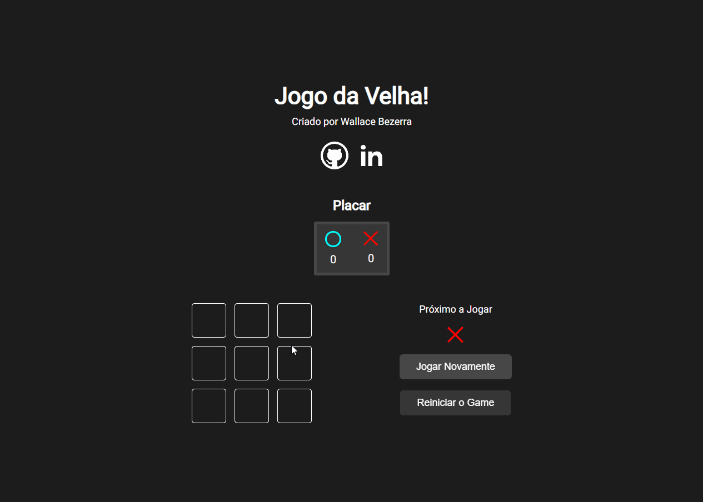
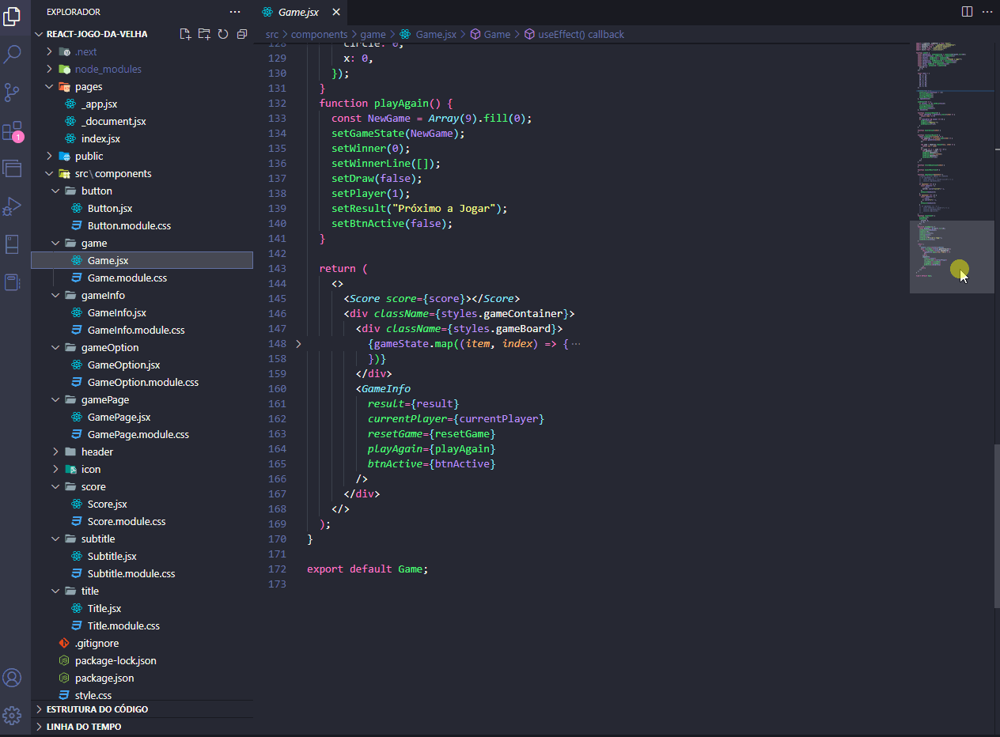
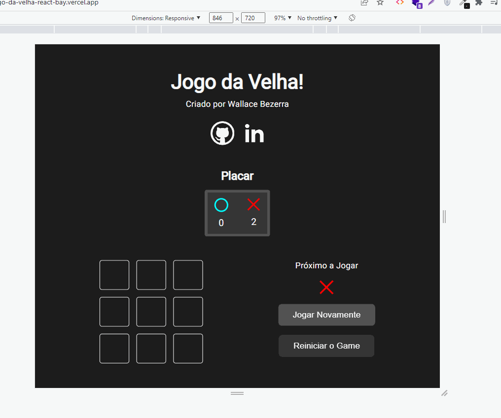

<h1 align="center"> Jogo da Velha </h1>

Esse é um projeto prático utilizando React

  <a href="#-tecnologias">Tecnologias</a>&nbsp;&nbsp;&nbsp;|&nbsp;&nbsp;&nbsp;
  <a href="#-projeto">Projeto</a>&nbsp;&nbsp;&nbsp;

 

  

  

## 💻 Projeto

O clássico jogo da velha onde utilizei os conceitos básicos do React como:
- Componentes
- Props e children
- Hooks (useState, useEffect)
- CSS modules

## 🚀 Tecnologias

Esse projeto foi desenvolvido com as seguintes tecnologias:

- HTML e CSS
- React
- [Node e NPM](https://nodejs.org/)
- [NextJs](https://vitejs.dev/)

## 📱 Mobile

  

---

Feito com ♥ by Wallace Bezerra

  

